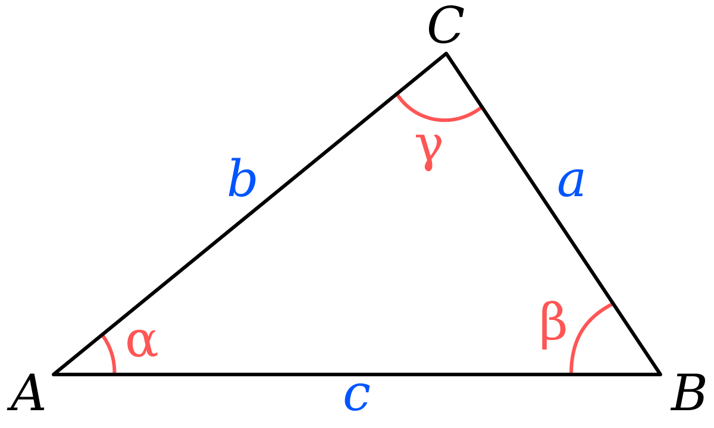

**Heron's Formula**: $A = \sqrt{ s(s-a)(s-b)(s-c) }$ where $s = \frac{a+b+c}{2}$

**SAS Area Formula**: $A = \frac{1}{2} a b \sin(\gamma)$ where $\gamma$ is the angle opposite side $c$.

$\therefore \sqrt{ s(s-a)(s-b)(s-c)} = \frac{1}{2}ab\sin(\gamma)$

$2 \times \sqrt{ s(s-a)(s-b)(s-c)} = 2 \times \frac{1}{2}ab\sin(\gamma)$

$2 \times \sqrt{ s(s-a)(s-b)(s-c)} = \cancel{ 2 \times \frac{1}{2} }ab\sin(\gamma)$

$2 \times \sqrt{ s(s-a)(s-b)(s-c)} = ab\sin(\gamma)$

$\frac{2 \times \sqrt{ s(s-a)(s-b)(s-c)}}{ab} = \frac{ab\sin(\gamma)}{ab}$

$\frac{2 \times \sqrt{ s(s-a)(s-b)(s-c)}}{ab} = \frac{\cancel{ ab }\sin(\gamma)}{\cancel{ ab }}$

$\therefore \sin(\gamma) = \frac{2 \times \sqrt{ s(s-a)(s-b)(s-c)}}{ab}$

$\therefore \gamma = \arcsin (\frac{2 \times \sqrt{ s(s-a)(s-b)(s-c)}}{ab})$, Note that $\arcsin$ = $\sin^{-1}$
