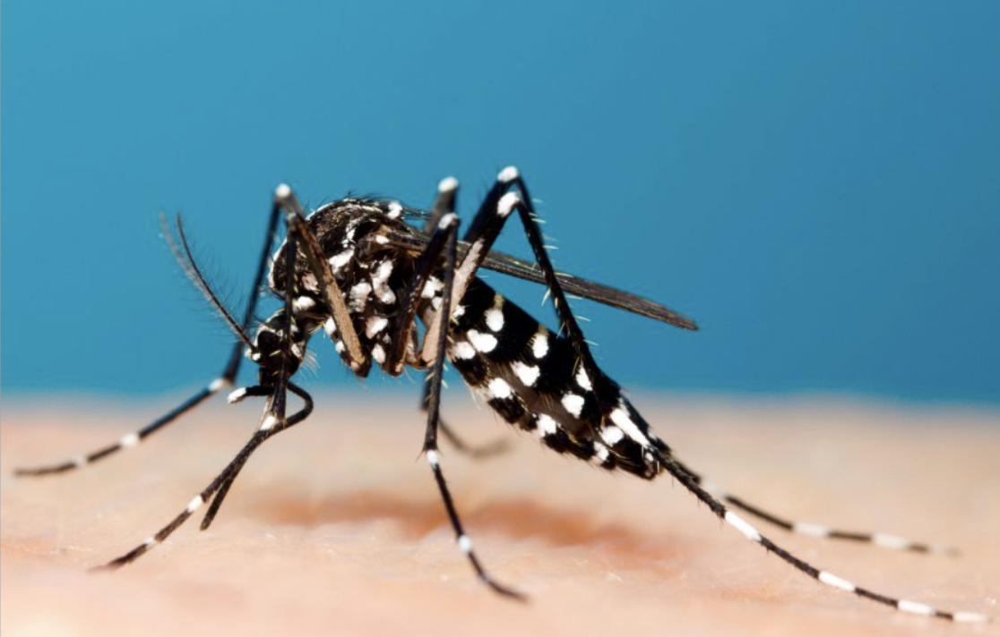

### Structure
Ross River Virus is an endemic RNA virus found predominantly in Australia, but has been discovered in other Pacific nations such as Papua New Guinea.  

Coming under the classification of an Alphavirus, the Ross River Virus' genome is entirely made of RNA.  The shape of the Ross River Virus is also spherical, and the virus itself is incredibly small, being around 70nm in diameter. The Ross River Virus is single-stranded alongside being a RNA virus.

when the virus passes through a cell's membrane, this RNA is released to order the cell's nucleus to replicate virus RNA and proteins. The presence of a protein shell (capsid) located within the membrane protects the genome and allows a stable environment for the genome to persist against biological and chemical agents. This combats defence mechanisms employed by cells, such as protease. The viral envelope surrounding a Ross River Virus' protein shell is comprised from the intracellular membrane of the virus' host cell, which allows the virus to pass through other membranes of similar cells. This is aided by the presence of glycoproteins dispersed on the virus' envelope.

### Symptoms
Ross River Virus is loosely termed "epidemic polyarthritis", with its primary symptoms being arthritis and joint pain, alongside a rash occurring around 10 days after arthritis. Infection also comes with flu-like symptoms, such as flu, chills, and headaches.

Most concerningly, Ross River Virus causes fatigue in almost all cases (90%), which can turn into chronic fatigue, which affects 9% of individuals a year after infection.

Its virulence is quite potent, causing fatigue and arthritis-related symptoms that can significantly damage an infected person's body. However, it is not fatal, with not a single death as a result of Ross River Virus being reported.

### Risk
Most cases of Ross River Virus are found within Queensland, the Northern Territory, and tropical regions of Western Australia, with the risk of contracting Ross River Virus increasing greater rainfall. In tropical areas, cases of Ross River Virus are more common during the "wet season", i.e. when rainfall is at its greatest, and mosquito populations are high. Specific areas of high risk are communities near the Murray River.

Individuals near adequate areas for mosquito breeding (marsh, wetland, standing water) are more at risk, and thus Ross River Virus mostly affects rural areas. 

There is no distinction between how the virus affects gender, but adults aged between 25-44 years old are more likely to be infected.

### Mode of Transmission
The virus is indirectly spread via vectors, i.e. mosquitos. Virus particles are transmitted to a host population via a second separate population. In this case, individuals of the second population are considered "vectors", and usually are blood-sucking arthropods such as mosquitos and ticks. Ross River Virus uses mosquitos as a vector, most prevalently mosquitos of the Aedes genus.

Transmission for Ross River Virus occurs when a vector bites an infected individual, which a chance of the disease being transmitted to the vector. This vector then bites another individual. At this stage, the individual is not yet infected. However, if the virus is not eradicated within the individual's body, the individual becomes infectious after a latency period. A new vector can then bite the newly infected individual, repeating the cycle.

### Graph Analysis

(sourced from the Department of Health and Aged Care website)

This graph shows that outbreaks of the Ross River Virus are periodical, occurring mostly every January, which is during Summer in Western Australia. After Summer ends, cases drop off significantly. This is a sign that the Ross River Virus is seasonal, and is most common during the Summer period. The data from the graph indicates that the number of Ross River Virus cases is directly linked to the climate of the environment, i.e. what season it is in.

### Treatment and Prevention
Patients are given painkillers, anti-inflammatories or corticosteroids for rashes, and anti-pyretics for fevers. They are told to rest, as there is no definitive cure against the virus. As of 2016, researchers at Griffith University were conducting trials into the effectiveness of Elmiron (pentosan polysulfate), which appeared to be promising. Due to there being no cure, patients of Ross River Virus must battle with the virus to gain natural immunity.

A vaccine for Ross River Virus does not exist. Thus, the main form of prevention for this virus is minimising mosquito bites, as this is the only vector that transmits the virus. People living near high risk areas are told to frequently use mosquito repellent, wear light-coloured clothing, reducing standing water around their homes, etc. As there is no vaccine, there is no form of artificial immunity to Ross River Virus. If an individual recovers from Ross River Virus (which usually takes 3-6 months),  studies show this individual will gain both passive and active immunity to the virus, which last for life.

### APA7 References
- Horwood, C. M., & Bi, P. (n.d.). _The incidence of Ross River virus disease in South Australia, 1992 to 2003_. Department of Health and Aged Care. Retrieved November 1, 2022, from https://www1.health.gov.au/internet/main/publishing.nsf/Content/cda-cdi2903i.htm
- Ong, O. T., Skinner, E. B., Johnson, B. J., & Old, J. M. (2021). Mosquito-borne viruses and non-human vertebrates in Australia: A Review. _Viruses_, _13_(2), 265. https://doi.org/10.3390/v13020265
- Department of Health & Human Services. (2000, April 4). _Ross River Virus disease_. Better Health Channel. Retrieved November 1, 2022, from https://www.betterhealth.vic.gov.au/health/conditionsandtreatments/ross-river-virus-disease
